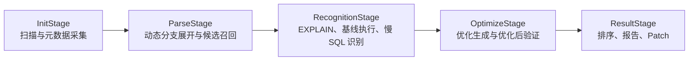

# 架构设计

## 总览

下一代方案仍保留 5 个阶段，但职责重新定义为：

## 五阶段职责

| 阶段 | 核心职责 | 关键输出 |
|------|----------|----------|
| Init | 扫描 XML，采集表结构、索引、表行数、字段分布 | `sql_units`、`table_metadata`、`column_distributions` |
| Parse | 展开 MyBatis 动态分支，生成高风险候选 branch | `branch_candidates` |
| Recognition | 对 branch 生成参数 case，执行 `EXPLAIN` 与基线执行，识别慢 SQL | `slow_sql_findings` |
| Optimize | 对已识别慢 SQL 生成优化方案，并验证优化前后差异 | `optimization_proposals` |
| Result | 汇总优先级、报告、Patch、覆盖率说明 | `report`、`patches` |

## 核心分层

### 1. 事实层

由阶段 1 输出，包含：

- SQL 语句清单
- 表结构与索引
- 表行数
- 条件字段分布
- statement 到字段使用情况的映射

### 2. 候选层

由阶段 2 输出，包含：

- statement 的 branch 清单
- 各 branch 的静态风险分
- branch 的参数槽位定义
- branch 覆盖标签

### 3. 证据层

由阶段 3 输出，包含：

- 参数 case
- `EXPLAIN` 基线
- 真实执行基线
- 结果集签名
- 慢 SQL finding

### 4. 优化层

由阶段 4 输出，包含：

- 优化建议
- 索引建议
- 优化后验证
- before/after 对比

### 5. 交付层

由阶段 5 输出，包含：

- 排名结果
- 汇总报告
- 按 namespace/statement 的 patch

## 架构关键决策

### 决策 1：阶段 1 必须采集字段分布

原因：

- 不能依赖生产运行时参数
- 阶段 3 需要据此生成代表性参数 case
- 阶段 2 需要据此给 branch 做风险排序

### 决策 2：阶段 3 同时承担 `EXPLAIN` 与基线执行

原因：

- 阶段 3 的本质是识别与确证慢 SQL
- 阶段 4 应只专注优化，不再做原 SQL 的识别职责

### 决策 3：阶段 4 必须做优化后验证

原因：

- 优化不是只写一条建议
- 必须验证结果集是否一致
- 必须验证性能是否提升

### 决策 4：大项目采用分区索引 + 实体文件 + JSONL 分片

原因：

- 根目录不能存在超大聚合文件
- 不能出现百万级小文件失控
- 需要兼顾可读性与批量处理效率

## 对“大项目”的架构要求

### 目录规模

- 以 namespace、table、severity 等自然维度分区
- 根级 `_index.json` 只保存分区索引，不内联全部实体

### 文件类型选择

- 稳定实体：单文件 JSON
- 高基数测量数据：分片 JSONL
- 汇总视图：小型聚合 JSON

### 读取方式

- 先读 `manifest.json`
- 再读根级 `_index.json`
- 按需读取局部分区 `_index.json`
- 最后定位到具体实体文件或 JSONL shard

## 关键收益

该架构相比当前方案，多出的核心价值是：

- 从“通用优化建议”升级为“慢 SQL 发现与证据化优化”
- 在无法直接依赖生产运行时数据的前提下，最大化候选召回率
- 对大项目输出更可控，避免单文件和小文件爆炸两种极端
