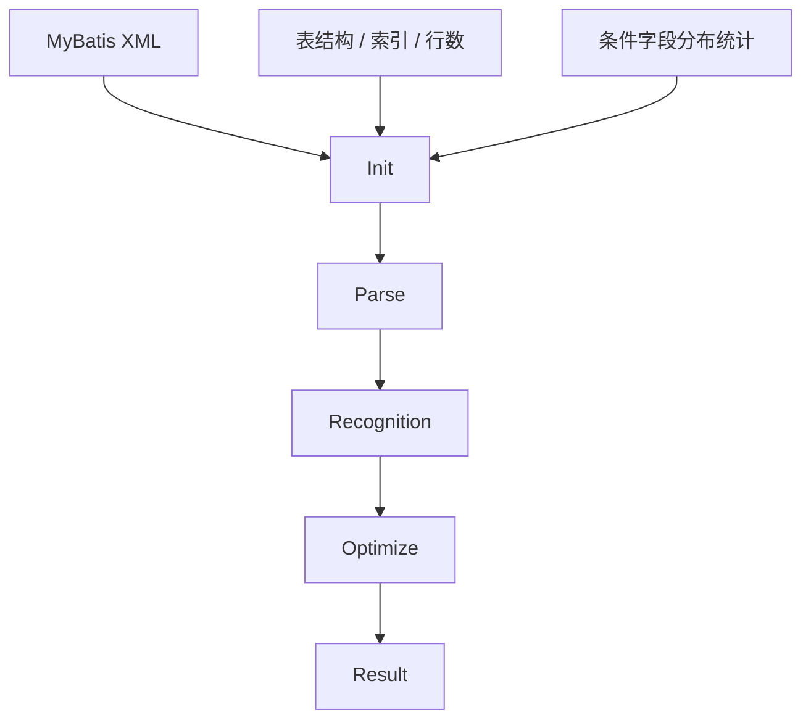

# 数据流设计

## 端到端数据流



## 阶段输入输出

| 阶段 | 输入 | 输出 | 下游使用方 |
|------|------|------|-----------|
| Init | XML、表结构、索引、表行数、字段分布 | `sql_units`、`table_metadata`、`column_distributions`、`column_usage_maps` | Parse、Recognition、Optimize、Result |
| Parse | `sql_units`、`column_distributions`、`table_metadata` | `branch_candidates` | Recognition |
| Recognition | `branch_candidates`、`column_distributions`、`table_metadata` | `parameter_cases`、`explain_baselines`、`execution_baselines`、`slow_sql_findings` | Optimize、Result |
| Optimize | `slow_sql_findings`、`execution_baselines`、`explain_baselines` | `optimization_proposals`、`optimization_validations` | Result |
| Result | 所有阶段摘要与关键实体 | `report`、`patches`、`ranking` | 用户 / 平台 |

## 阶段 1 到阶段 2

阶段 1 产出的 `column_usage_maps` 与 `column_distributions` 会被阶段 2 用于：

- 判定哪些 branch 更危险
- 标记低选择性条件
- 标记热点值驱动的 branch
- 给 `foreach / IN / range / order by` 分支增加优先级

## 阶段 2 到阶段 3

阶段 2 不只是传 SQL 文本，而是传递完整 branch 语义：

- branch 对应的 `active_conditions`
- `parameter_slots`
- `static_risk_score`
- `coverage_tags`

阶段 3 基于这些语义生成参数 case，而不是只对 SQL 做盲目替换。

## 阶段 3 到阶段 4

阶段 3 要把以下信息完整交给阶段 4：

- 原始 SQL
- branch ID
- 参数 case
- `EXPLAIN` 计划
- 原 SQL 实际执行基线
- 结果集签名
- 慢 SQL 的根因列表

阶段 4 因此不再承担“找慢 SQL”的职责，只承担：

- 生成优化方案
- 验证优化方案

## 阶段 4 到阶段 5

阶段 5 从阶段 4 获取：

- 最佳 proposal
- 优化收益
- 结果集一致性结论
- 风险说明
- patch 数据

最终形成：

- 全局排行
- namespace 级报告
- statement 级 patch

## 数据流中的三类数据

### 1. 稳定事实

生命周期长，可跨阶段复用：

- `sql_units`
- `table_metadata`
- `column_distributions`

### 2. 分析中间产物

生命周期覆盖多个阶段：

- `branch_candidates`
- `slow_sql_findings`
- `optimization_proposals`

### 3. 高基数测量记录

数据量大，需分片：

- `parameter_cases`
- `explain_baselines`
- `execution_baselines`
- `optimization_validations`

## 关键数据引用链

```text
statement_key
  -> path_id
    -> case_id
      -> finding_id
        -> proposal_id
```

系统中的所有对比、报告、patch 都必须围绕这条引用链展开。
